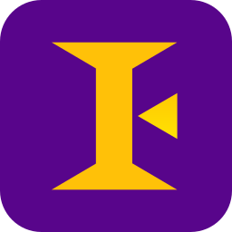

 

  

 
 
 

 

# Imperium exporter
Una herramienta para traducir modelos 3D desde [Blender](https://www.blender.org/) a texturas de Imperium de manera automática. La herramienta consta de dos partes:

1. un add-on de Blender, que renderiza la escena varias veces y genera los sprites individuales y las distintas máscaras (nivel, color del jugador, etc.). 

2. La segunda parte de la herramienta utiliza [Octave](https://www.gnu.org/software/octave/) para combinar todas las texturas de manera rápida y eficiente, sacando como output un .BMP que se puede incorporar al sistema de texturas de Imperium.

## Road to 2.0
* [ ] Arreglar apaños del color de nivel y jugador.
* [ ] Limpiar el código de Python.
* [ ] Documentar el add-on.
* [ ] Separar el código de Octave en funciones.
* [ ] Documentar el código de Octave.
* [ ] Documentar el repositorio y traducir al castellano.
* [ ] Vídeo demostración.
* [ ] Vídeo promoción.

## Incluye
* [ ] Implementar texturas de sombra.
* [x] Implementar color del nivel.
* [x] Implementar color del jugador.
* [ ] Implementar texturas de edificio.
* [ ] Implementar texturas para la GUI.

## Instalación
Para instalar el add-on de Imperium Renderer descarga o clona este repositorio y entonces ve a Blender. En  _edit > preferences > add-ons_ selecciona 'instalar desde archivo' y navega hasta la carpeta que acabas de descargar. Una vez allí selecciona el archivo `imperium_renderer.py`.

## Manual de uso (en desarrollo)
### Blender
First, create the model of your asset (unit, building, etc.) and animate it if necessary. Then, create a default camera in the addon panel or modify a camera you have selected. This should give you an imperium-like view of your model. Then adjust the resolution and the number of frames for that animation. Don't forget to extend the start and end frames so the whole animation is included.

Create an empty object and make the armature/mesh child of this empty by selecting the armature, then the empty (holding shift) and pressing 'P' (parent). With the object picker select the empty and finally select the output path. Once these steps are done you can press the 'Render' button and the sprites will be rendered into the output folder.

### Octave
Now the `confiuration.cfg` file must be properly filled with the spritesheet details. Once this is done the `imperium_assembler.m` file can be executed from Octave. Although you can use the console version, for new people I recommend the more user-friendly GUI version. Select the working directory on the top drop-down menu and type _imperium\_assembler_ in the console (or push the play button). In the output folder specified in the configuration a new bmp image will appear. This texture is ready to be converted to mmp and compressed into the package used by the game. 

## Más información
* Actualizaré la [wiki](https://github.com/JavierRojo/Imperium_exporter/wiki) de este repositorio cuando la herramienta esté acabada.
* El resultado parcial de esta herramienta puede verse [aquí](https://youtu.be/MGJLMHRm75E).
* Más información en el [Blog de desarrollo](https://www.youtube.com/playlist?list=PL_zV6BZZ-V3c3P5ECvt4QKXoIlzdFlKu2).
